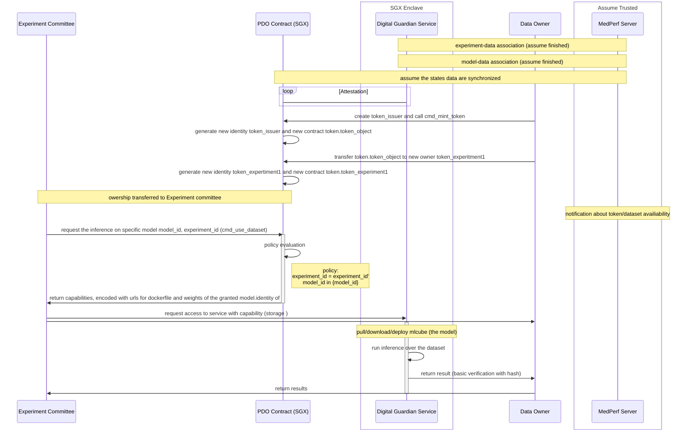

## Workflow

## Protocols

From the dataset owner side:
+ The dataset is identified by its hash.
+ Tokens are minted based on hash-based binding.
+ Guardian service of the token exposes an api to the callers 

## Core functions 

+ Allow data owner to tokenize a dataset (into a PDO contract)
  + with default policy checking the registration information from MedPerf
  + ownership transfer to experiment committee
  + generate capability to grant access to the guardian service

+ Allow experiment committee to initilize the use of data by interacting with PDO
  + capabilities are published on MedPerf server (or PDO states/ledger?) for downloading

+ Allow data owner to host a guardian service, which exposes interface (local) to initilize the test
  + data owner downloads the capability from the server (or ledger)
  + data owner feeds the capability to guardian service to initialize the experiment
  + guardian service publish experiment results to the server (or ledger)
    + allows access control?

### Guardian service 

Datasets are hosted behind the service.
<!-- The service can be called from the  -->
<!-- + called from the model owner -- one model inference over the dataset -->
<!-- + called from the experiment committee (TBA) -->

The guardian service is co-located with the dataset. guadian service provides a wsgi api to process the capability. Capability encodes `{model_id, dataset_id, url_to_docker, url_to_weights}`. After receiving capability, the guardian service:
1. pull/build docker images from `url_to_docker`
2. download weights from `url_to_weights`
3. model up and run over `dataset_id` 

no execution integrity for now.
<!-- dataset encryption -->

### Contract methods

new contract methods under the class `ww::medperf::token_object`

`initialize`: public methode, mint token for the dataset, actual method behind `cmd_mint_token`
  1. kvs of the experiment/model/dataset info
  2. Store the registered metadata from medperf service (synthetic for PoC).
  3. set a `max_evaluation`
 
| Keys | Values |
| ---- | ---- |
| experiment_id | identifier for the experimetn |
| model_id | identifier for the model |
| {urls} | url to model assets |
| dataset_id | hash of the dataset |
| max_evaluation | most models that allowed to evaluate  |
| cur_evaluation | 0 |
| approved_capability| {} |
| TBA |

`get_datasetinfo`: public method, get the non-secret kvs info of dataset token
return the information associated with the dataset.

capability -links to- identity // invoked by the dataowner only

<!-- `get_capability`:
  1. called by model owner -->

`use_dataset(model_id, dataset_id, experiment_id)`: only invoked by TO
  1. check if model_id, dataset_id, experiment_id are in the kv storage
  2. cur_evaluation + 1, if cur_evaluation = max_evaluation, fail
  3. invoke `get_capability` and return secretly encoded {urls}.

allows multiple models in one call

`get_capability`: only invoked by TO, parse capability kv